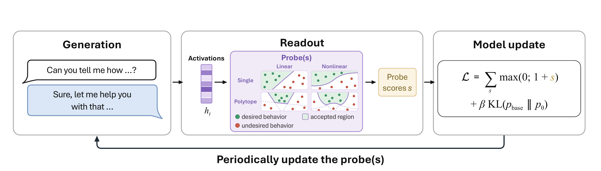

# Training Against Probes

Code for **[Alignment via Training Against Probes Without Losing Monitorability](https://arxiv.org/abs/2609.38645)**.

Language models are usually aligned on their outputs, with demonstrations, preference data or
reward signals. These objectives reward responses that *look* aligned, and a capable model can
satisfy them without internalising the intended behavior. We instead use **probes on the model's
internal activations as the only alignment signal**.



## Method

At every training step we

1. **Generate** on-policy completions from the current model,
2. **Read out** their residual-stream activations and score every completion token with one or
   more probes. A probe is linear, $z(h) = w^\top h + b$, or non-linear with a sparse ReLU
   encoder, $z(h) = w^\top \mathrm{ReLU}(Eh + e) + b$. With $K$ probes at a layer, the region where
   every probe is negative is a **polytope** (Chen et al., 2025),
3. **Update** a LoRA adapter with a hinge loss that pushes activations into the accepted region
   with a margin, plus a KL term to the base model on a fixed pool of benign chats:

$$\mathcal{L} = \frac{1}{|\mathcal{T}|}\sum_{t \in \mathcal{T}} \sum_{k=1}^{K} \max\big(0,\ 1 + z_k(h_t)\big) + \beta\,\mathrm{KL}\big(p_{\text{base}} \,\|\, p_\theta\big)$$

4. **Refit the probes** on the updated model's activations. The probes are either *frozen*
   (never refit), *continuously updated* (refit from their current weights after every step) or
   *retrained* (refit from scratch).

The key design choice is the update regime:

- **Frozen probes are evaded.** The model moves its activations across the fixed decision
  boundary, the probe loss goes to zero, and harmful behavior stays.
- **Continuously updated probes change the behavior itself.**

## Main findings

- **Harmlessness.** Training against continuously updated probes sharply lowers StrongREJECT on
  abliterated Llama 3 8B Instruct and Mistral 7B Instruct v0.1, while utility (MMLU, GSM8K,
  IFEval) stays within 95% of the base model.
  - **Robust to attacks:** the gains hold under GCG and prefill attacks.
  - **Robust to abliteration:** re-abliterating the trained models changes StrongREJECT by only
    -0.03 to +0.07, against +0.67 for Llama 3 8B Instruct.
  - **How models become safe:** they rarely refuse explicitly; instead they reinterpret harmful
    requests as benign ones.
- **Honesty.** On Qwen3-14B, with the probe reading the reasoning trace, MASK honesty under
  pressure rises from 0.47 to 0.63 (linear probe), 0.70 (non-linear polytope) and 0.75 (linear
  polytope), at base-model utility.
- **Monitorability is preserved.** Linear probes fitted from scratch on the trained models still
  reach held-out AUROC of 0.85-0.90 for harmfulness and 0.98-0.99 for dishonesty, close to the
  base models.
- **Baselines.** At a matched data budget, probe-guided fine-tuning gives a better
  safety-utility trade-off than DPO and inference-time steering (CAA, SafeFlow).

## Repository layout

| Path | What it does |
|---|---|
| `src/finetune.py` | Probe-guided LoRA training: on-policy generation, probe/polytope loss, KL anchor, frozen / continuously updated / retrained regimes |
| `src/finetune_eval.py` | Evaluation during training (probe AUROC, utility) |
| `src/probes/probe_archs.py`, `train.py`, `evaluate.py`, `dataset.py` | Detectors: linear probe and polytope (linear or non-linear encoder), fitting and evaluation |
| `src/probes/build_kl_groundtruth.py`, `build_kl_rollouts.py` | Build the KL anchor pool |
| `src/probes/eval_checkpoint.py`, `baseline_strongreject.py` | Utility and JailbreakBench StrongREJECT for checkpoints and base models |
| `src/probes/refit_both_auroc.py`, `refit_layer_sweep_auroc.py` | Monitorability: fresh probes on trained checkpoints |
| `src/attacks/` | ClearHarm robustness: direct query, prefill attack, GCG |
| `src/eval/strongreject_rubric/` | StrongREJECT rubric judge (DeepSeek v4 Flash) and rescoring |
| `src/probes/mask_generate.py`, `src/eval/mask/` | MASK honesty evaluation |
| `src/steering/` | CAA and SafeFlow steering baselines |
| `src/dpo_finetune.py` | DPO baseline |
| `src/asr/` | StrongREJECT judging during training, XSTest over-refusal |
| `src/probe_analysis/` | LLM-judge categories of completions (refusal, soft refusal, pseudo-compliance, ...) |
| `src/eval/` | Additional utility evaluation, ClearHarm generation |
| `src/configs/` | Default configuration, merged under every run config |
| `configs_runs/` | Run configs: `example.yaml` (safety), `honesty_example.yaml` (honesty), `dpo_example.yaml` (DPO) |
| `third_party/` | Pinned external code we patch or import (claudini, SafetyPolytope) |

## Installation

We use [uv](https://docs.astral.sh/uv/) to manage the environment.

```bash
git clone <this repository> training_against_probes
cd training_against_probes
uv sync          # Python 3.12 + locked environment (torch 2.6, vLLM 0.8.5.post1, transformers 4.51.3)
```

Run the commands below with `uv run python ...`.

### Configuration

Copy `.env.example` to `.env`, fill it in and export it (`set -a; source .env; set +a`).

| Variable | Meaning |
|---|---|
| `NM_ROOT` | Root for inputs and outputs (default `/data/new_master`): `datasets/` (KL anchors, MASK selection), `lora-finetuned/<run_id>/step_<N>/` (checkpoints and probes), `live_downstream/<run_id>/` (evaluations) |
| `HF_HOME` | Hugging Face cache (library default if unset) |
| `PROBE_COMPLETIONS_DATASET` | Training prompts and labelled completions (default `lenalibon/jailbreak-judge-completions`) |
| `ABLITERATED_MODEL` | Abliterated Llama 3 8B Instruct (default `lenalibon/Meta-Llama-3-8B-Instruct-heretic-mlabonne`) |
| `WANDB_ENTITY`, `WANDB_PROJECT` | Your Weights & Biases account (or set `WANDB_MODE=offline`) |
| `JUDGE_API_KEY`, `JUDGE_BASE_URL`, `JUDGE_MODEL` | OpenAI-compatible endpoint for the DeepSeek judges (defaults `https://opencode.ai/zen/v1`, `deepseek-v4-flash`) |
| `OPENAI_API_KEY` | Only for the completion-category judge in `src/probe_analysis/` |

### Models and data

Training runs offline (`HF_HUB_OFFLINE=1`), so download what you need first.

```bash
huggingface-cli login
for m in mistralai/Mistral-7B-Instruct-v0.1 lenalibon/Meta-Llama-3-8B-Instruct-heretic-mlabonne \
         meta-llama/Meta-Llama-3-8B-Instruct Qwen/Qwen3-14B qylu4156/strongreject-15k-v1; do
  huggingface-cli download "$m"
done
for d in lenalibon/jailbreak-judge-completions PKU-Alignment/BeaverTails Cadenza-Labs/liars-bench \
         allenai/Dolci-Instruct-SFT JailbreakBench/JBB-Behaviors AlignmentResearch/ClearHarm \
         walledai/XSTest cais/MASK; do
  huggingface-cli download --repo-type dataset "$d"
done
```

The KL term is computed on a fixed pool of benign Dolci-Instruct-SFT chats, stored in
`$NM_ROOT/datasets/`:

```bash
# Safety runs: the dataset's reference answers (CPU only)
python src/probes/build_kl_groundtruth.py dolci              # -> dolci_kl_groundtruth.json
# Honesty runs: answers of the untrained Qwen3-14B, with thinking (GPU, a few hours)
SOURCE=dolci BASE_MODEL=Qwen/Qwen3-14B ROLLOUT_TAG=qwen3i14b ENABLE_THINKING=1 \
  N_PROMPTS=800 MAX_NEW_TOKENS=1536 python src/probes/build_kl_rollouts.py
```

## Training

```bash
# Safety: Mistral 7B Instruct v0.1, continuously updated non-linear K=16 polytope at layer 19
FINETUNE_CONFIG=configs_runs/example.yaml WANDB_RUN_ID=safety01 python src/finetune.py

# Honesty: Qwen3-14B, continuously updated linear deception probe over layers 20-35
FINETUNE_CONFIG=configs_runs/honesty_example.yaml WANDB_RUN_ID=honesty01 python src/finetune.py
```

Checkpoints, together with the probes used at each step, are written to
`$NM_ROOT/lora-finetuned/<run_id>/step_<N>/`. The safety run also tracks utility and held-out
JailbreakBench StrongREJECT every step, and stops once utility falls below
`finetune.utility_threshold_pct` of the base model.

Detector variants are set in the run config:

| Variant | Setting |
|---|---|
| Linear probe vs polytope | `probe.detector_type: linear-probe` or `polytope-probe`, with `num_facets` (K) |
| Linear vs non-linear features | `probe.use_nonlinear` |
| Frozen / continuously updated / retrained | `finetune.probe_retrain_mode` and `probe_retrain_steps` (frozen: `probe_retrain_steps: 0`) |
| Abliterated Llama 3 8B | `model.model_name: $ABLITERATED_MODEL`, `finetune.kl_penalty: 4` |

## Evaluation

All scripts read checkpoints from `$NM_ROOT/lora-finetuned/<run_id>/step_<N>` and write to
`$NM_ROOT/live_downstream/<run_id>/`.

**Utility and JailbreakBench StrongREJECT**
```bash
RUN_ID=safety01 BASE_MODEL=mistralai/Mistral-7B-Instruct-v0.1 STEPS=0,10,20 python src/probes/eval_checkpoint.py
BASE_MODEL=mistralai/Mistral-7B-Instruct-v0.1 python src/probes/baseline_strongreject.py
```

**ClearHarm robustness** (40 prompts: direct query, prefill and GCG attacks)
```bash
python src/attacks/clearharm_direct_prefill.py --rid safety01 --step 20 --modes direct,prefill
python src/attacks/clearharm_direct_prefill.py --base-model mistralai/Mistral-7B-Instruct-v0.1 --name mistral_v01

# GCG with claudini, pinned and patched to accept LoRA checkpoints
git clone https://github.com/romovpa/claudini && cd claudini
git checkout f97da47ca1f4cfcadb26ce54fd98ed4d960bd157
git apply ../third_party/claudini/claudini_lora.patch && uv sync && cd ..
CLAUDINI_DIR=$PWD/claudini CLAUDINI_PYTHON=$PWD/claudini/.venv/bin/python \
  bash src/attacks/run_gcg.sh $NM_ROOT/lora-finetuned/safety01/step_20 $NM_ROOT/claudini_clearharm/safety01_step20 all
python src/attacks/gcg_regenerate.py --rid safety01 --step 20 --gcg-dir $NM_ROOT/claudini_clearharm/safety01_step20

# StrongREJECT rubric scores with DeepSeek v4 Flash (as reported in the paper)
python src/eval/strongreject_rubric/rescore.py $NM_ROOT/live_downstream/safety01
```

- **First scoring:** `clearharm_direct_prefill.py` and `gcg_regenerate.py` score with the
  fine-tuned StrongREJECT judge and write `step_<N>.json`.
- **Rubric scores:** `rescore.py` adds the DeepSeek rubric scores next to them as
  `deepseek_step_<N>.json`.
- **GCG settings:** the 30-token suffix, the FLOP budget of 1e17 and the target string are in
  `third_party/claudini/clearharm_ours.yaml`.

**MASK honesty** (100 stratified MASK items)
```bash
python src/probes/mask_generate.py --build-selection          # once -> $NM_ROOT/datasets/mask_100.json
ENABLE_THINKING=1 THINKING_BUDGET=1024 ANSWER_BUDGET=512 \
  python src/probes/mask_generate.py --base-model Qwen/Qwen3-14B --enable-thinking \
    --lora-rank 64 --max-tokens 2048 --max-model-len 16384 --rid honesty01 --steps 0-30 --force
python src/eval/mask/grade_mask.py --rid honesty01 --steps 0-30 --work-dir mask_grading
python src/eval/mask/extract_table.py --results-dir mask_grading/curve_results \
    --point base=honesty01_step00 --point probe=honesty01_step17
```

- **Score:** honesty is the response-weighted mean of MASK's `honesty_score_1` over its six
  archetypes.
- **Judge errors:** steps where the judge returns errors are not written; rerun the same
  command to retry them.

**Monitorability** (fresh linear probe and K=16 polytope on a trained checkpoint)
```bash
RUN_ID=safety01 CONFIG=configs_runs/example.yaml STEPS=1,10,20 python src/probes/refit_both_auroc.py
RUN_ID=safety01 CONFIG=configs_runs/example.yaml STEP_EVERY=5 python src/probes/refit_layer_sweep_auroc.py
```

**XSTest over-refusal**: `cd src && python -m asr.xstest_overrefusal`

## Baselines

**DPO** on the same prompt-paired BeaverTails data
```bash
DPO_CONFIG=configs_runs/dpo_example.yaml WANDB_RUN_ID=dpo750 python src/dpo_finetune.py
RUN_ID=dpo750 BASE_MODEL=mistralai/Mistral-7B-Instruct-v0.1 python src/probes/eval_checkpoint.py
```

**CAA and SafeFlow steering** (Mistral 7B Instruct v0.1, layer 19)
```bash
python src/steering/caa_eval.py --n-train 750

bash third_party/fetch_safety_polytope.sh      # SafetyPolytope at a pinned commit
# SafeFlow steers with the step-1 polytope of a paired, continuously updated K=16 run
P=$NM_ROOT/lora-finetuned/<paired_run>/step_1/probes/layer_19
python src/steering/safeflow_eval.py --n-train 750 --polytope-ckpt $P --shard-by-lambda --lambdas 0
for L in 2 4 6 8 10 12; do
  python src/steering/safeflow_eval.py --n-train 750 --polytope-ckpt $P --shard-by-lambda --lambdas $L --no-sr
  python src/steering/safeflow_sr.py  --n-train 750 --polytope-ckpt $P --lambda $L
done
python src/steering/merge_safeflow.py --n-train 750 --truncate
```

The paper uses n_train 500, 750, 1000 and 5000 for all methods.

## Citation

```bibtex
@misc{libon2026alignmenttrainingprobeslosing,
      title={Alignment via Training Against Probes Without Losing Monitorability},
      author={Lena Libon and Alexander Panfilov and Ben Rank and Xin Chen and Jonas Geiping and Maksym Andriushchenko},
      year={2026},
      eprint={2609.38645},
      archivePrefix={arXiv},
      primaryClass={cs.LG},
      url={https://arxiv.org/abs/2609.38645},
}
```
